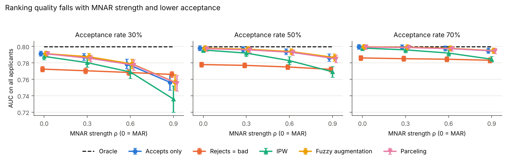

# Missing Data Solutions and Their Potential for Reject Inference in Credit Scoring

**Type:** Master's Thesis

**Author:** Bora Eguz

**1st Examiner:** Prof. Dr. Stefan Lessmann (to be confirmed)

**2nd Examiner:** tbd



## Table of Content

- [Summary](#summary)
- [Working with the repo](#working-with-the-repo)
    - [Dependencies](#dependencies)
    - [Setup](#setup)
- [Reproducing results](#reproducing-results)
- [Results](#results)
- [Project structure](#project-structure)

## Summary

Lenders only observe repayment outcomes for applicants they accepted, so the
labels of rejected applicants are missing. When the past acceptance decision
used information that is not in the data (missing not at random, MNAR),
scorecards trained on accepted applicants are biased. This thesis compares
missing-data methods for the *label* (outcome) with established reject
inference methods in a controlled simulation where the full population
(the Oracle) is known, and varies how strongly the selection is MNAR.

**Keywords**: reject inference, credit scoring, missing not at random, sample selection bias, Heckman selection model, label imputation

**Full text**: link follows after submission.

## Working with the repo

### Dependencies

Python 3.11 (3.10-3.12 also work) and the packages in `requirements.txt`.

### Setup

1. Clone this repository
```bash
git clone https://github.com/boraegz/MSc_Thesis_Missing_Data.git
cd MSc_Thesis_Missing_Data
```

2. Create a virtual environment with Python 3.11 and install the requirements
```bash
python3.11 -m venv .venv
source .venv/bin/activate
pip install --upgrade pip
pip install -r requirements.txt
```

3. Run the tests
```bash
pytest
```

## Reproducing results

All randomness flows from `study.base_seed` in the config, so every run is
reproducible.

```bash
python run_experiments.py            # full study: 24 settings x 20 replications (~1 min on a laptop)
python run_experiments.py --quick    # 2 replications, smoke test
python make_figures.py               # figures from the newest results file
```

Raw results go to `results/raw/<study>_<timestamp>.csv` together with a copy
of the config and a summary table (means, 95% confidence intervals and paired
differences to the Oracle and to accepts-only).

### Simulation design

Each applicant has features X, a true default propensity eta(X) (linear plus a
nonlinear part, so the logistic scorecard is misspecified, as in practice) and
a default outcome Y. A past lender accepted applicants with its *old* scorecard
plus private information; labels are kept only for accepted applicants.

| Setting | Values | Meaning |
| --- | --- | --- |
| `rho` | 0, 0.3, 0.6, 0.9 | MNAR strength: correlation between the lender's private information and default (0 = MAR) |
| `acceptance_rate` | 0.3, 0.5, 0.7 | share of historical applicants with observed labels |
| `exclusion_restriction` | true, false | whether a variable that moves acceptance but not default is recorded |

Full details: docstring of `src/data/simulation.py`.

## Results

Main figures (written by `make_figures.py` to `results/figures/`):

- `auc_vs_rho.png` - ranking quality on all applicants
- `calibration_vs_rho.png` - predicted vs. true default rate
- `bad_rate_vs_rho.png` - defaults among approved applicants at 50% approval

## Project structure

```bash
├── README.md
├── requirements.txt                          -- dependencies (Python 3.11)
├── configs/
│   └── experiment_config.yaml                -- simulation grid, methods, seeds
├── run_experiments.py                        -- runs the study, saves results
├── make_figures.py                           -- draws thesis figures
├── src/
│   ├── data/simulation.py                    -- population + acceptance policy (label selection)
│   ├── reject_inference/                     -- one class per method, common interface
│   │   ├── base.py                           -- interface + scorecard learners
│   │   ├── baselines.py                      -- accepts only, rejects = bad
│   │   ├── reweighting.py                    -- inverse probability weighting
│   │   └── augmentation.py                   -- fuzzy augmentation, parceling
│   ├── evaluation.py                         -- AUC, Brier, KS, bad rate, mean PD
│   ├── experiments.py                        -- grid x replications runner, summary
│   └── utils.py                              -- config loading, seeding
├── tests/                                    -- pytest suite (incl. leakage tests)
├── notebooks/archive/                        -- earlier notebooks; use the old code, do not run
└── results/                                  -- raw results (git-ignored) and figures
```
